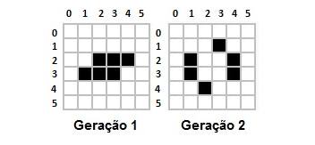

## Matrizes

### [Exercício 01](https://github.com/LucasDSL/MATA57-LAB1/blob/baccceeb574cc6d32ca76863c2ba27ab1719af0c/05%20Matrizes/e1.c)

[adaptado de Pereira (2010)].Escreva um programa que leia duas matrizes de inteiros e preencha uma terceira matriz com o resultado da soma das duas. As matrizes devem ter dimensões N x M, em que N e M serão dados pelo usuário. Sabe-se que N e M são números entre 1 e 100.

### [Exercício 02](https://github.com/LucasDSL/MATA57-LAB1/blob/baccceeb574cc6d32ca76863c2ba27ab1719af0c/05%20Matrizes/e2.c)

Faça um programa que receba as dimensões e os elementos de uma matriz e gere a sua transposta.

### [Exercício 03](https://github.com/LucasDSL/MATA57-LAB1/blob/baccceeb574cc6d32ca76863c2ba27ab1719af0c/05%20Matrizes/e3.c)

Escreva um programa que leia duas matrizes de inteiros e preencha uma terceira matriz com o resultado do produto das duas.

### [Exercício 04](https://github.com/LucasDSL/MATA57-LAB1/blob/baccceeb574cc6d32ca76863c2ba27ab1719af0c/05%20Matrizes/e4.c)

[TheHuxley, 2021]. Chama-se de quadrado mágico um arranjo, na forma de um quadrado, de N x N números inteiros tal que todas as linhas, colunas e diagonais têm a mesma soma. Por exemplo, o quadrado abaixo: 
2 7 6 
9 5 1 
4 3 8 
é um quadrado mágico de soma 15, pois todas as linhas (2 + 7 + 6 = 15, 9 + 5 + 1 = 15 e 4 + 3 + 8 = 15), colunas (2 + 9 + 4 = 15, 7 + 5 + 3 = 15 e 6 + 1 + 8 = 15) e diagonais (2 + 5 + 8 = 15 e 6 + 5 + 4 = 15) têm a mesma soma (15). 

Escreva um programa que, dado um quadrado, determine se ele é magico ou não e qual a soma dele (caso seja mágico).

### [Exercício 05](https://github.com/LucasDSL/MATA57-LAB1/blob/baccceeb574cc6d32ca76863c2ba27ab1719af0c/05%20Matrizes/e5.c)

O Jogo da Vida é um jogo sem jogadores, todos os eventos ocorridos são consequências do estado inicial do campo, esse campo é uma matriz formada por células vivas ou mortas (1 ou 0, respectivamente), o estado dessas células é alterado ou mantido dependendo das condições ao seu redor, as condições estão descritas abaixo: 

- Qualquer célula viva com menos de dois vizinhos vivos morre de solidão.

- Qualquer célula viva com mais de três vizinhos vivos morre de superpopulação

- Qualquer célula morta com exatamente três vizinhos vivos se torna uma célula viva.

- Qualquer célula viva com dois ou três vizinhos vivos continua no mesmo estado para a próxima geração.

- Para cada alteração no campo(todas ocorrem simultaneamente) temos uma geração.

Exemplo com 2 gerações (Células pretas estão vivas, as brancas estão mortas): 

Observe que na próxima geração o estado do campo voltará ao mesmo estado anterior, e assim sucessivamente, porém não é sempre que isso acontece.

O problema é, dados um campo n x m, as posições onde há células vivas inicialmente, e um número de gerações, imprimir o campo de cada geração seguindo o formato de saída. Considere que qualquer célula fora do campo está sempre morta. O programa deve receber quatro números inteiros, representando o número de linhas do campo, o número de colunas do campo, o número de células vivas no campo inicial e o número de geração a serem computadas. Além disso, o usuário deve informar cada uma das posições na matriz (linha e coluna) onde há células vivas.
